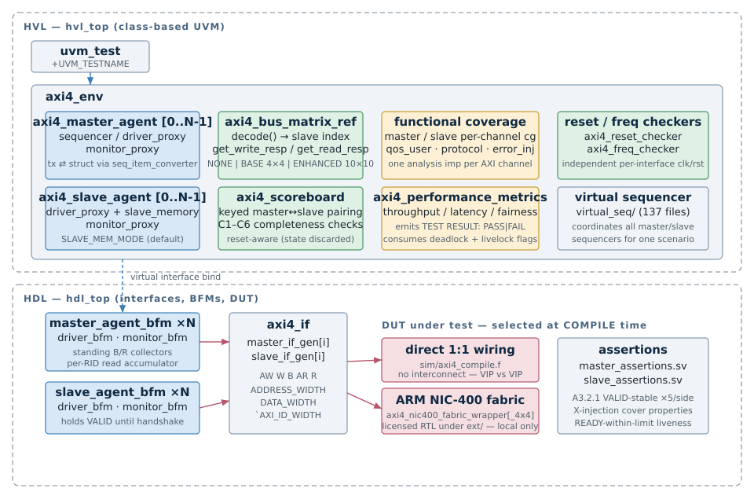
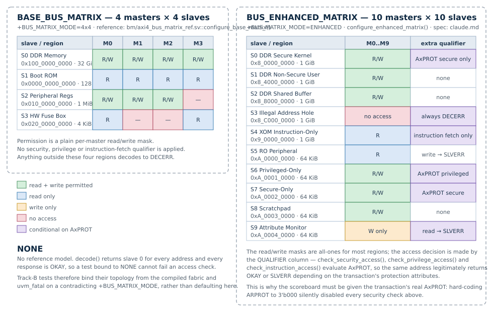

# tim_axi4_vip — AXI4 UVM Verification IP

SystemVerilog/UVM verification IP for ARM® AMBA® AXI4, built around a configurable
multi-master / multi-slave bus matrix reference model. It runs in two modes:

* **VIP-vs-VIP** — masters wired 1:1 to slaves, no interconnect. This is the default
  build and what the regression uses.
* **Track-B** — the same VIP driving a **commercial fabric IP** interconnect as DUT,
  in either a 4×4 or a 10×10 topology.

> **Licensed IP notice.** The commercial fabric IP RTL under `ext/` is licensed third-party IP and is
> **local-only**. It must never be committed, pushed, archived, or pasted into any external
> service, and neither may simulator artefacts built from it (`csrc*/`, `simv*`, `*.daidir/`).
> `.gitignore` enforces this and is part of the policy. See `CLAUDE.md`.

---

## Platform structure



The split is the usual HVL/HDL one:

| Layer | Lives in | Responsibility |
|---|---|---|
| **HVL** (`hvl_top`) | classes, `uvm_pkg` | test, env, agents' proxies, scoreboard, coverage, reference model |
| **HDL** (`hdl_top`) | modules/interfaces | `axi4_if` instances, driver/monitor BFMs, clock & reset generation, the DUT |

Proxies talk to their BFM through a virtual interface; transactions cross the boundary as
plain structs via `axi4_*_seq_item_converter`. Which DUT sits between the master and slave
interfaces is a **compile-time** choice (the file list), not a runtime one.

### Component map

```
axi4_env
├── axi4_master_agent[0..N-1]     sequencer → driver_proxy → driver_bfm
│                                  monitor_bfm → monitor_proxy → analysis ports
├── axi4_slave_agent[0..N-1]      driver_proxy + axi4_slave_memory (SLAVE_MEM_MODE)
├── axi4_bus_matrix_ref           address decode + per-master access matrix (the oracle)
├── axi4_scoreboard               keyed master↔slave pairing, C1–C6 completeness checks
├── axi4_performance_metrics      throughput / latency / fairness → "TEST RESULT: PASS|FAIL"
├── coverage                      master, slave, qos_user, protocol, error-injection
└── axi4_reset_checker / axi4_freq_checker
```

Both `axi4_master_agent` and `axi4_slave_agent` publish **five** analysis ports (AW, W, B,
AR, R). Each coverage component takes one analysis imp per channel, so a packet is only
sampled by the covergroup whose fields it actually carries.

---

## Repository layout

```
tim_axi4_vip/
├── agent/
│   ├── master_agent_bfm/       axi4_master_{agent,driver,monitor}_bfm.sv
│   └── slave_agent_bfm/        axi4_slave_{agent,driver,monitor}_bfm.sv
├── assertions/                 master_assertions.sv, slave_assertions.sv (+ tb_* harness stubs)
├── bm/                         axi4_bus_matrix_ref.sv — the reference model / oracle
├── env/                        env, config, scoreboard, coverage, perf metrics, checkers
├── include/                    axi4_bus_config.svh — widths, IDs, tags, drain time
├── intf/axi4_interface/        axi4_if.sv — the AXI4 interface
├── master/                     agent, config, proxies, tx, converters, coverage, sequencers
├── slave/                      agent, config, proxies, tx, converters, coverage, memory
├── pkg/                        axi4_globals_pkg.sv — enums and transfer structs
├── seq/                        master_sequences/, slave_sequences/  (~270 files)
├── virtual_seq/                cross-agent scenario sequences (~137 files)
├── virtual_seqr/               axi4_virtual_sequencer.sv
├── test/                       187 test classes + axi4_test_pkg.sv
├── top/                        hdl_top.sv, hvl_top.sv, fabric IP wrappers, fabric smoke TB
├── sim/
│   ├── axi4_compile.f              baseline (no interconnect)
│   ├── axi4_compile_fabric_ip.f       Track-B 10×10
│   ├── axi4_compile_*_4x4.f        Track-B 4×4 (commercial fabric IP)
│   ├── *_rtl.f                     commercial fabric IP RTL file lists
│   ├── coverage_scope.cm_hier      code-coverage instrumentation scope
│   ├── run_fabric_smoke.sh         fabric-only sanity, no UVM
│   └── synopsys_sim/               build/run area, axi4_regression.py
├── testlists/                  regression test lists
├── doc/                        documents and figures (doc/img/*.svg)
└── ext/                        commercial fabric IP deliverable — LOCAL ONLY, never uploaded
```

Authoritative specs: **`claude.md`** (lowercase) is the 10×10 access matrix and address map.
`CLAUDE.md` (uppercase) is the working agreement for this repo — build recipes, publish
policy, iron rules. They are different files; do not conflate them.

---

## Bus matrix modes



`bm/axi4_bus_matrix_ref.sv` implements three modes (`bus_matrix_mode_e`):

| | `NONE` | `BASE_BUS_MATRIX` | `BUS_ENHANCED_MATRIX` |
|---|---|---|---|
| Masters × slaves | 4 × 4 (nominal) | 4 × 4 | 10 × 10 |
| Address decode | every address → slave 0 | 4 regions, else DECERR | 10 regions, else DECERR |
| Access control | none — always OKAY | per-master R/W bitmask | R/W bitmask **plus** AxPROT qualifiers |
| Security (`AxPROT[1]`) | not modelled | not modelled | `check_security_access()` on S0, S7 |
| Privilege (`AxPROT[0]`) | not modelled | not modelled | `check_privilege_access()` on S6 |
| Instruction (`AxPROT[2]`) | not modelled | not modelled | `check_instruction_access()` on S4 |
| Write-only region | — | — | S9 (read → SLVERR) |
| Hard hole | — | — | S3 (all access → DECERR) |
| Plusarg | `+BUS_MATRIX_MODE=NONE` | `+BUS_MATRIX_MODE=4x4` | `+BUS_MATRIX_MODE=ENHANCED` |

### BASE — 4 × 4

| Slave | Base address | Size | M0 | M1 | M2 | M3 |
|---|---|---|---|---|---|---|
| S0 DDR Memory | `0x0000_0100_0000_0000` | 32 GiB | R/W | R/W | R/W | R/W |
| S1 Boot ROM | `0x0000_0000_0000_0000` | 128 KiB | R | R | R | R |
| S2 Peripheral Regs | `0x0000_0010_0000_0000` | 1 MiB | R/W | R/W | R/W | — |
| S3 HW Fuse Box | `0x0000_0020_0000_0000` | 4 KiB | R | — | — | R |

### ENHANCED — 10 × 10

| Slave | Base address | Size | Masters | Qualifier |
|---|---|---|---|---|
| S0 DDR Secure Kernel | `0x0000_0008_0000_0000` | 1 GiB | R/W all | secure only |
| S1 DDR Non-Secure User | `0x0000_0008_4000_0000` | 1 GiB | R/W all | — |
| S2 DDR Shared Buffer | `0x0000_0008_8000_0000` | 1 GiB | R/W all | — |
| S3 Illegal Address Hole | `0x0000_0008_C000_0000` | 1 GiB | none | always DECERR |
| S4 XOM Instruction-Only | `0x0000_0009_0000_0000` | 1 GiB | R all | instruction fetch only |
| S5 RO Peripheral | `0x0000_000A_0000_0000` | 64 KiB | R all | write → SLVERR |
| S6 Privileged-Only | `0x0000_000A_0001_0000` | 64 KiB | R/W all | privileged only |
| S7 Secure-Only | `0x0000_000A_0002_0000` | 64 KiB | R/W all | secure only |
| S8 Scratchpad | `0x0000_000A_0003_0000` | 64 KiB | R/W all | — |
| S9 Attribute Monitor | `0x0000_000A_0004_0000` | 64 KiB | W all | read → SLVERR |

### The difference that matters

In **BASE**, permission is a static per-master bitmask — an address either is or is not
reachable by a given master.

In **ENHANCED**, most regions have all-ones masks and the decision is made by the **AxPROT
qualifier**. The same address, from the same master, legitimately returns `OKAY` or
`SLVERR` depending on the transaction's security / privilege / instruction attributes.

That has a direct consequence for the checkers: any component that evaluates the access
matrix must pass the transaction's *real* `AxPROT`. Hard-coding it (e.g. `ARPROT = 3'b000`)
does not merely weaken the check — it disables every security rule above while still
reporting success.

### `NONE` is not a safe default

`NONE` routes every address to slave 0 and answers `OKAY` unconditionally, so a test bound
to it **cannot fail an access check**. Track-B tests therefore bind their topology at
compile time and `uvm_fatal` if `+BUS_MATRIX_MODE` contradicts it, instead of silently
degrading.

---

## AXI4 protocol coverage

This is a full **AMBA AXI4** (not AXI3, not AXI4-Lite) VIP. What that means concretely,
checked against the interface (`intf/axi4_interface/axi4_if.sv`), the transaction classes
(`master/axi4_master_tx.sv`, `pkg/axi4_globals_pkg.sv`), and the reference bus matrix
(`bm/axi4_bus_matrix_ref.sv`):

### Implemented

| Feature | Notes |
|---|---|
| All 5 channels, AXI4 pin set | No `WID` — write bursts are identified solely by `AWID`, matching AXI4's removal of per-beat write IDs (AXI3 had `WID`; AXI4 does not). |
| 8-bit `AxLEN` | Up to 256-beat `INCR` bursts, the AXI4 extension over AXI3's 4-bit/16-beat limit. |
| Burst types | `FIXED`, `INCR`, `WRAP`, with length-legality constraints (`FIXED`/`WRAP` ≤ 16 beats, `WRAP` length a power of 2) — `master/axi4_master_tx.sv`. |
| All 4 responses | `OKAY`, `EXOKAY`, `SLVERR`, `DECERR` on both write (`BRESP`) and read (`RRESP`). |
| Exclusive access | `AxLOCK` + `EXOKAY`, with exclusive-monitor tracking on the slave side. |
| Outstanding / multi-ID transactions | Configurable per-slave response ordering: in-order, read-only out-of-order, write-only out-of-order, or both (`RESP_IN_ORDER` / `*_OUT_OF_ORDER` in `pkg/axi4_globals_pkg.sv`), plus dedicated cross-ID and same-ID reorder tests. |
| No write-data interleaving | Enforced and tested as an AXI4 rule (spec section A5.4) — AXI4 removed interleaving; a manager's write beats for different AWIDs are never interleaved on the W channel. |
| `AxPROT` (security / privilege / instruction) | Enforced by the reference bus matrix in `ENHANCED` mode — see [Bus matrix modes](#bus-matrix-modes) above. Not modelled in `NONE`/`BASE`. |
| `AxQOS`, `AxCACHE`, `AxREGION` | Driven, randomized, and functionally covered (dedicated QoS-priority/QoS-routing sequences, an arbitration-fairness metric). **Not** consumed as scheduling or memory-behaviour input by the reference model — see caveats below. |
| `AxUSER`/`WUSER`/`BUSER`/`ARUSER`/`RUSER` | All 5 channels, independently configurable widths (`include/axi4_bus_config.svh`), with a dedicated USER-signal test suite (passthrough, corruption, width-mismatch, protocol-violation). |
| Narrow / unaligned / sparse-strobe transfers | Including non-contiguous `WSTRB` per beat (AXI4 A3.4.3 byte-lane rules) and 4 KiB boundary-crossing checks. |
| Reset behaviour | Independent, mid-burst, and multi-reset scenarios across a dedicated reset test family. |
| Protocol-level SVA | X-propagation, VALID-stability-until-handshake, and per-channel handshake legality — `assertions/master_assertions.sv`, `assertions/slave_assertions.sv`. |
| Directed protocol-violation / error injection | X-injection on every channel control/data signal, AWID/illegal-WSTRB mismatches, and randomized multi-signal error injection. |

### Not implemented / out of scope

| Feature | Status |
|---|---|
| AXI4-Lite | Not supported — this VIP is full AXI4 only, no register-style single-beat-only mode. |
| AXI4-Stream | Not applicable — unrelated protocol. |
| Low-power interface (`CACTIVE`/`CSYSREQ`/`CSYSACK`) | Not modelled — absent from the interface and both BFMs. |
| QoS-driven arbitration as DUT behaviour | The reference bus matrix does **not** use `AxQOS` to schedule or prioritize; `AxQOS` is stimulus/coverage only in VIP-vs-VIP mode. Real QoS arbitration is exercised only when Track-B's commercial fabric IP is the DUT — the fabric arbitrates, the VIP does not. |
| `AxCACHE`-driven memory behaviour | Cache attributes are protocol-legal and covered but do not change the abstract slave memory model (no write-through/write-back/allocate distinction). |
| `AxREGION`-driven decode | Covered as a field; not used to select a distinct memory region in the reference model. |
| AXI5 extensions (atomics, MTE, poison, etc.) | Out of scope — this is an AXI4, not AXI5, VIP. |

---

## Build and run

All commands run from `sim/synopsys_sim/`. Toolchain: **VCS W-2024.09-SP1**.

### 1. Baseline — VIP vs VIP (no interconnect)

```bash
vcs -full64 -lca -kdb -sverilog +v2k -debug_access+all -ntb_opts uvm-1.2 \
    -override_timescale=1ps/1ps +nospecify +no_timing_check \
    -f ../../sim/axi4_compile.f -o simv

./simv +UVM_TESTNAME=axi4_blocking_write_read_test +UVM_VERBOSITY=UVM_LOW
```

### 2. Track-B — commercial fabric IP, 10×10

```bash
vcs -full64 -lca -kdb -sverilog +v2k -debug_access+all -ntb_opts uvm-1.2 \
    -override_timescale=1ps/1ps +nospecify +no_timing_check \
    +define+BUS_MATRIX_FABRIC_IP \
    +define+DATA_WIDTH=256 +define+AXI_ID_WIDTH=8 +define+AXI_ID_LAST=255 \
    -f ../../sim/axi4_compile_fabric_ip.f -o simv_trackb

./simv_trackb +UVM_TESTNAME=axi4_trackb_smoke_test +UVM_VERBOSITY=UVM_LOW
```

`AXI_ID_LAST` must equal `2**AXI_ID_WIDTH - 1`. It exists as a separate literal because VCS
rejects an enum range built from a computed expression (`Error-[ETRNC]`); `hdl_top` asserts
the two agree at time 0.

### 3. Track-B — commercial fabric IP, 4×4

```bash
vcs ... +define+BUS_MATRIX_FABRIC_IP +define+FABRIC_IP_4X4 \
        +define+DATA_WIDTH=256 +define+AXI_ID_WIDTH=6 +define+AXI_ID_LAST=63 \
        -f ../../sim/axi4_compile_fabric_ip_4x4.f -o simv_trackb4x4

./simv_trackb4x4 +UVM_TESTNAME=axi4_trackb_4x4_smoke_test +UVM_VERBOSITY=UVM_LOW
```

### 4. Fabric-only smoke (no UVM)

```bash
bash ../run_fabric_smoke.sh          # expect: FABRIC SMOKE TEST PASSED (3/3)
```

Gates on **log content**, not on exit status — a VCS run that ends in `$fatal` still exits 0.

---

## Configuration reference

### Compile-time defines

| Define | Default | Meaning |
|---|---|---|
| `DATA_WIDTH` | 1024 | AXI data bus width |
| `ADDRESS_WIDTH` | 64 | address width |
| `AXI_ID_WIDTH` | 4 | AxID / xID width |
| `AXI_ID_LAST` | 15 | literal `2**AXI_ID_WIDTH - 1` (see above) |
| `AXI_VID_WIDTH` | 4 | ingress-port tag width inside the fabric |
| `AXI_{AW,W,B,AR,R}USER_WIDTH` | 16 | per-channel USER widths |
| `AXI4_END_OF_TEST_DRAIN_NS` | 5000 | end-of-test drain, in ns (see below) |
| `BUS_MATRIX_FABRIC_IP` | off | build against the commercial fabric IP |
| `FABRIC_IP_4X4` | off | select the 4×4 fabric instead of 10×10 |
| `FABRIC_IP_DEBUG_PROBE` | off | fabric-boundary tracing |
| `DUMP_FSDB` | off | enable FSDB waveform dumping |
| `DISABLE_X_ASSERTIONS` | off | drop the X-injection assertion block |

### Runtime plusargs

| Plusarg | Meaning |
|---|---|
| `+UVM_TESTNAME=<class>` | selects the test |
| `+UVM_VERBOSITY=UVM_LOW\|MEDIUM\|HIGH` | verbosity; comparison verdicts print at HIGH |
| `+BUS_MATRIX_MODE=NONE\|4x4\|ENHANCED` | reference-model topology |
| `+ntb_random_seed=<n>` | seed — always record it with a result |
| `+END_OF_TEST_DRAIN_NS=<n>` | override the drain time |
| `+fsdbfile=<path>` | FSDB output path (needs `+define+DUMP_FSDB`) |
| `+SB_SELFTEST_COMPLETENESS=<mask>` | inject one synthetic completeness fault per bit — proves each check can fire |
| `+SB_KEYED_PAIRING=<0\|1>` | keyed vs FIFO-order master/slave pairing |
| `+disable_end_of_test_checks=1` | opt out of end-of-test checking (logged as a warning) |

### End-of-test drain

A `NON_BLOCKING` sequence completes at the **address** handshake — `item_done()` is called
there, not at the response. Every non-blocking test is
`raise_objection → seq.start → drop_objection`, so without a drain the run phase ends with
W, B and R still in flight, and those tests verify only the address channels.

`axi4_env::run_phase` therefore sets a drain time (default 5 µs). It lives in the **env**
because the affected tests override `run_phase` without calling `super`, so anything placed
in `axi4_base_test::run_phase` would never execute for them.

### Pass criteria

A run passes only when **both** hold:

1. `UVM_ERROR : 0` in the report summary, **and**
2. `TEST RESULT: PASS` from `axi4_performance_metrics` (it consumes the deadlock and
   livelock flags for every test).

Do not gate on the simulator's exit code — a run ending `UVM_ERROR : 7` still exits 0.

---

## Regression

```bash
cd sim/synopsys_sim

# local
python3 axi4_regression.py --test-list ../../testlists/axi4_transfers_regression.list \
                           --max-parallel 4

# LSF
python3 axi4_regression.py --test-list ../../testlists/axi4_transfers_regression.list \
                           --lsf --max-parallel 6 --timeout 1800

# with coverage
python3 axi4_regression.py --test-list ... --lsf --max-parallel 6 --cov
```

| Option | Meaning |
|---|---|
| `--test-list` | path to the list; entries are `<test_name> run_cnt=<n>` |
| `--max-parallel` | number of execution folders **and** the concurrency limit |
| `--lsf` | submit through `bsub` instead of running locally |
| `--timeout` | per-test wall-clock limit, seconds |
| `--cov` | collect functional + code coverage into per-test `.vdb` |
| `--fsdb-dump` | add `+define+DUMP_FSDB` to the build |

Each job compiles its own `simv` inside an execution folder. `--max-parallel` bounds how
many folders exist *and* how many jobs may hold one at a time — two live jobs in one folder
would delete each other's build products.

Results land in `regression_result_<timestamp>/` with `regression_summary.txt`,
`no_pass_list`, and `logs/{pass_logs,no_pass_logs}/`.

> Two regression lists exist — `sim/axi4_transfers_regression.list` and
> `testlists/axi4_transfers_regression.list`. They are **not** currently in sync
> (133 tests in common; 41 only in `testlists/`, 1 only in `sim/`). Pick deliberately.

---

## Coverage

```bash
vcs ... -cm line+cond+fsm+tgl+branch+assert -cm_seqnoconst \
        -cm_hier ../../sim/coverage_scope.cm_hier -cm_dir cov.vdb

./simv ... -cm line+cond+fsm+tgl+branch+assert -cm_dir cov.vdb -cm_name <test>
urg -dir cov.vdb -format text -report cov_rpt
```

**Code coverage is scoped to the fabric interface only.** `coverage_scope.cm_hier` keeps
`hdl_top` and the project-authored `u_fabric_ip` wrapper and drops
`u_fabric_ip.u_fabric` — the generated fabric IP internals are licensed, pre-verified
third-party IP and are not a VIP verification target; ~300 vendor `.v` files in the
denominator only deflate LINE and TOGGLE. Functional coverage has no such carve-out.

Never merge `.vdb` databases across different builds: baseline and Track-B use different
defines and a different `-cm` scope.

---

## Waveform debug

```bash
vcs ... +define+DUMP_FSDB -o simv_fsdb
./simv_fsdb +UVM_TESTNAME=<test> +fsdbfile=/tmp/run.fsdb
```

The dump covers `hdl_top`, which is where the AXI pins are — dumping only `hvl_top` cannot
answer any question about `AWVALID`/`WREADY`/`WLAST` timing.

---

## Status

Measured, not aspirational. Numbers are only meaningful with the build and seed that
produced them.

* **Track-B 10×10 and 4×4** — smoke and coverage-sweep tests pass with `UVM_ERROR : 0`,
  `TEST RESULT: PASS` and `Protocol Issues : 0` (960 writes / 960 reads on 10×10;
  384 / 384 on 4×4).
* **Functional coverage is not at 100%**, and the reported figure is not yet a sound
  baseline: the model has been under repair (per-channel sampling, ID/response cross fixes,
  legality `ignore_bins`), and pre-repair merged numbers included hits scored by
  zero-filled fields on the opposite channel. Re-baseline before quoting a number.
* **Full regression** is being re-run after the end-of-test drain fix; the previous run's
  failures were concentrated in `axi4_non_blocking_*` tests that ended before their
  transactions completed.
* Known open items and traps live in `.claude/docs/known-landmines.md`.

If you find a check that looks present but never fires, that is a known failure mode in
this codebase — grep for `assert property` and for the actual sampling call, not for the
description comment above it.

---

## Key documents

| File | Contents |
|---|---|
| `claude.md` | 10×10 access matrix + address map — authoritative spec |
| `CLAUDE.md` | build recipes, publish policy, iron rules |
| `TRACKB_DEBUG_NOTES.md` | fabric IP integration evidence chain and open items |
| `VIP_future.md` | improvement plan |
| `.claude/docs/known-landmines.md` | traps earned in this repo, with reproduction |
| `AXI-Case-list.csv`, `doc/testcase_matrix.csv` | case status — verify before trusting |
